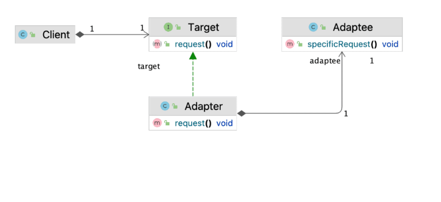
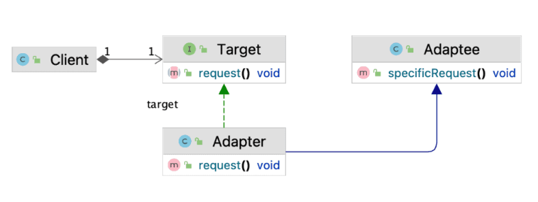
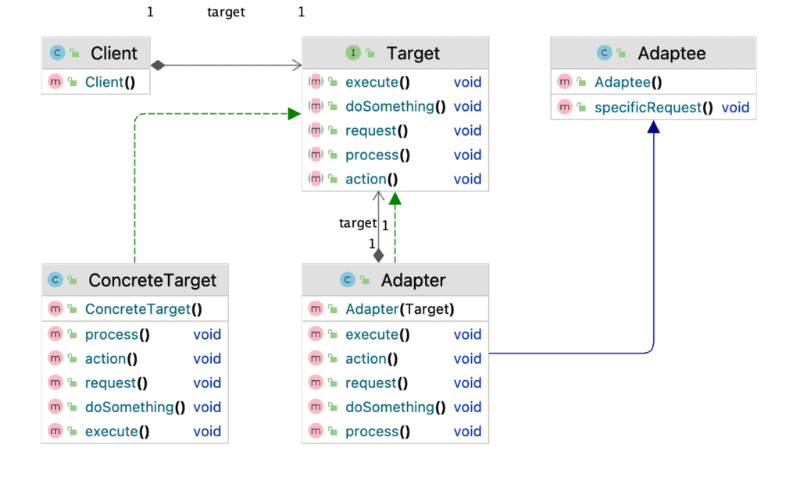
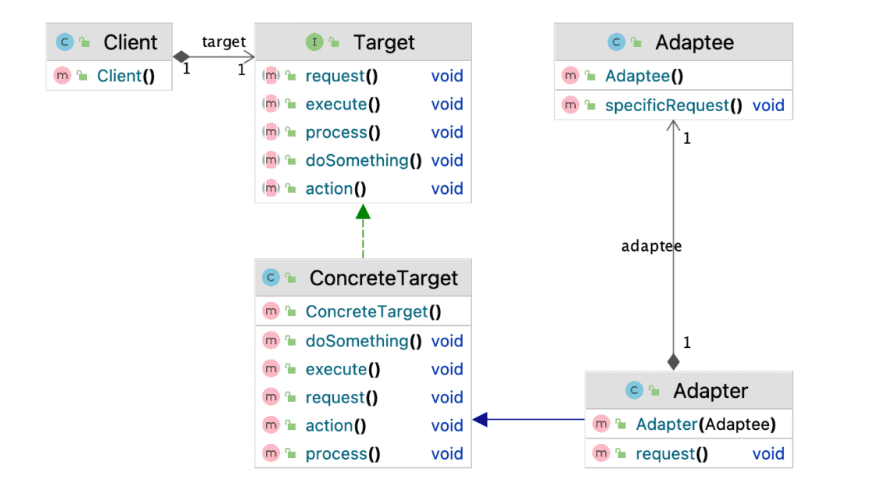

# Шаблон адаптера

## 1. Обзор

Шаблон адаптера действует как соединитель между двумя несовместимыми интерфейсами, которые в противном случае не могут
быть соединены напрямую. Основная цель этого шаблона — преобразовать существующий интерфейс в другой, который ожидает
клиент.

Структура этого шаблона похожа на Decorator . Однако Decorator обычно реализуется с учетом расширения. Adapter обычно
реализуется после написания начального кода для соединения несовместимых интерфейсов. Существует два основных способа
реализации этого шаблона, поэтому давайте рассмотрим их.

## 2. Адаптер объекта

Эта реализация использует композицию для делегирования логики адаптеру A. Это довольно простой способ добиться
соответствия интерфейса :

В этом случае адаптер содержит Adaptee и делегирует метод request() методу specificRequest()  в Adaptee .

### 3. Адаптер класса

Эта версия шаблона Adapter требует множественного наследования, что технически невозможно в Java, если мы не
рассматриваем интерфейсы с методами по умолчанию . Основная идея заключается в создании Adapter путем расширения классов
Target и Adapter . Однако мы можем реализовать это в Java, когда у нас есть Target как интерфейс, что проще сделать,
поскольку Target — это та часть, которую мы контролируем:

Выглядит очень похоже на Object Adapter, но теперь Adapter расширяет Adaptee вместо того, чтобы содержать его
композиционно. Одним из преимуществ этого подхода является то, что Adapter может использоваться в обоих контекстах, как
Target и как Adaptee. Технически мы создали двусторонний адаптер, что может быть очень удобно в определенных случаях.

## 4. Преимущества и компромиссы

Подход Class Adapter лучше всего работает с отображением один к одному между методами Target и Adaptee . Таким образом,
мы можем использовать делегирование без дополнительной реализации в Adapter. Однако, если интерфейс Target более
сложный , этот подход может потребовать дополнительной работы в Adapter. Однако мы можем решить эту проблему с помощью
делегирования:

Здесь мы делегируем только метод request() в Adaptee. Остальные берутся из ConcreteTarget. Мы можем использовать
композицию для делегирования этих методов интерфейса реализации, чтобы избежать дублирования кода. В то же время, если
нам не нужен двусторонний адаптер, мы можем использовать Object Adapter, что значительно упростит структуру:

Таким образом, способ реализации этого шаблона во многом зависит от начального состояния кодовой базы, от того, можем ли
мы использовать интерфейсы и нужно ли нам предоставить адаптерам возможность работать в обоих контекстах.